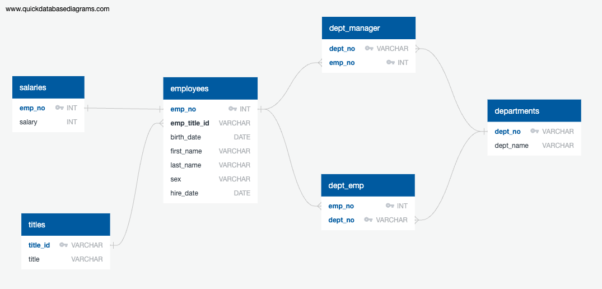
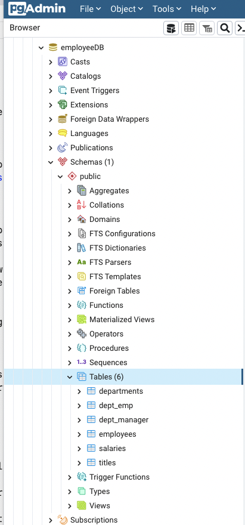
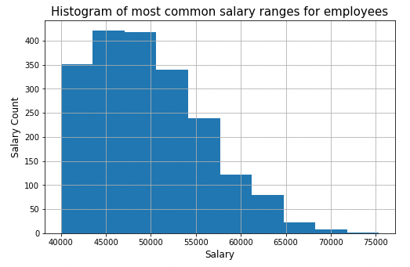
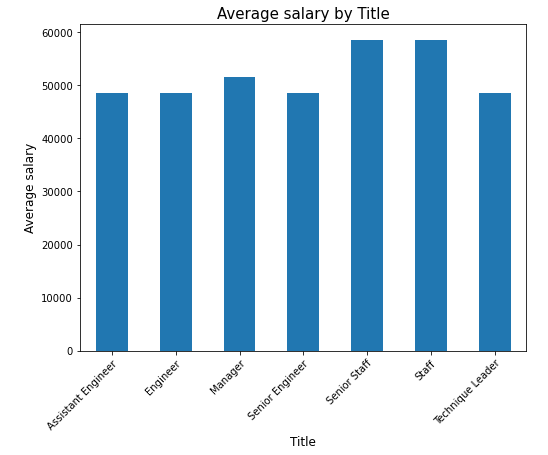

# Employee Database Research and Analysis

Author: Rosie Gianan, gianr00@gmail.com

Build With: PostgreSQL, pgAdmin, QuickDB, SQLAlchemy ORM queries, Python, Pandas and Matplotlib

## Objective:
Research on the employees of the corporation from the 1980s and 1990s. All that remains of the database of employees from that period are these six CSV files. 
-    [departments.csv](data/departments.csv)
-    [dept_emp.csv](data/dept_emp.csv)
-    [dept_manager.csv](data/dept_manager.csv)
-    [employees.csv](data/employees.csv)
-    [salaries.csv](data/salaries.csv)
-    [titles.csv](data/titles.csv)

Design the tables to hold the data in the csv files, import the data from csv files into a SQL database, and analyze the data. This involves data modeling, data engineering and data analysis.

## Solution:
1.    Create the Entity Relationship Diagram (ERD) of the 6 tables to hold the data from the 6 CSV files.

 

2.    Create a database named employeeDB with 6 tables to hold the data from the 6 CSV files

 

3.    Import each CSV file into the corresponding SQL table using pgAdmin import tool.
4.    Create the queries for the data analysis with the following information:
-    List the following details of each employee: employee number, last name, first name, sex, and salary.
-    List first name, last name, and hire date for employees who were hired in 1986.
-    List the manager of each department with the following information: department number, department name, the manager's employee number, last name, first name.
-    List the department of each employee with the following information: employee number, last name, first name, and department name.
-    List first name, last name, and sex for employees whose first name is "Hercules" and last names begin with "B."
-    List all employees in the Sales department, including their employee number, last name, first name, and department name.
-    List all employees in the Sales and Development departments, including their employee number, last name, first name, and department name.
-    List the frequency count of employee last names (i.e., how many employees share each last name) in descending order.
5.    Create a histogram to visualize the most common salary ranges for employees, i.e. occurs 10 or more.

 

6.    Create a bar chart to visualize the average salary by title
 
 

